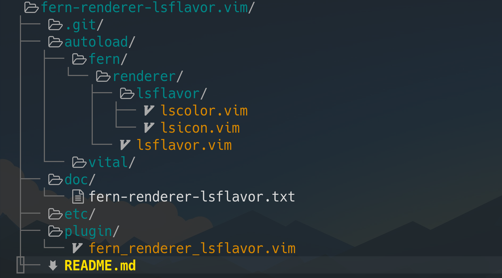

# fern-renderer-lsflavor.vim

fern-renderer-lsflavor.vim is a fern.vim renderer plugin with UNIX ls flavor, but it may be UNIX ls alternative's one. This plugin uses the configurations which are used by UNIX ls, because this is with ls flavor.

See `:h fern-renderer-lsflavor` for more details.
